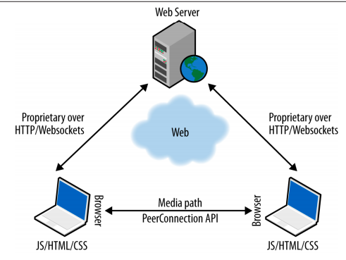
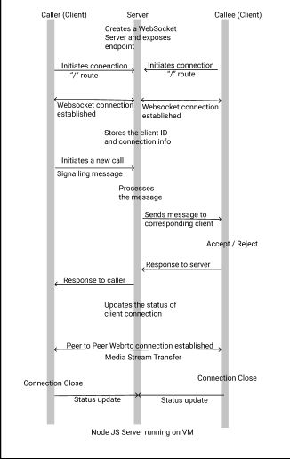
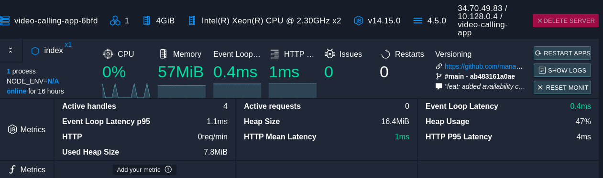
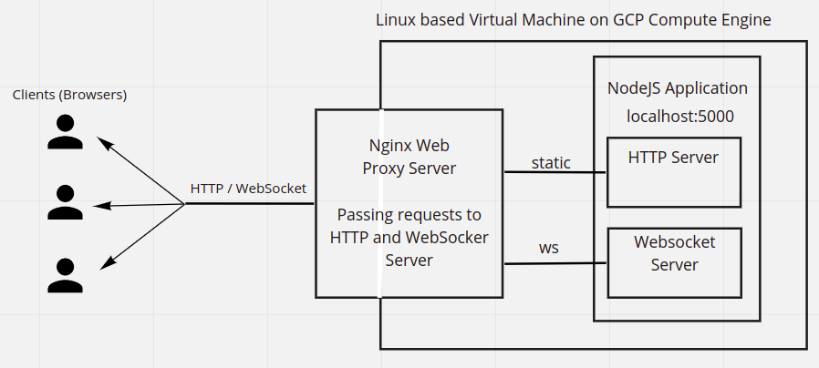

# Video Calling Application

A real time peer to peer video calling application, provided as a service. Approach, Working and Installation steps mentioned below. 

## Collaborators

- [Jinesh Patel](https://github.com/jineshpatel0303)
- [Dhairya Dudhatra](https://github.com/Dhairya-Dudhatra)

## Index
- [Implementation Approach](#implementation-approach)
- [Setting up project locally](#setting-up-project-locally)
- [Running on Cloud](#running-on-cloud)
- [Monitoring using Process Manager](#monitoring-using-process-manager)
- [Architecture](#architecture)
- [Limitations and Future Work](#limitations-and-future-work)

## Implementation Approach

1. Former Approach

    - This approach involved a server acting as a middleware for connecting and passing data between 2 peers. The communication takes place using sockets and connection details are stored at server.

    - Forces the data to pass through server (peer -> server -> peer).

    - Additional security required on top of sockets.

    - Increased latency and encoding/decoding of media stream required at peer.

2. New Approach

    - Using Peer to Peer (P2P) communication paradigm between 2 clients (browsers).

    - WebRTC (Web Real time communication) standard. More details can be found [here](https://webrtc.org/) and [here](https://developer.mozilla.org/en-US/docs/Web/API/WebRTC_API).

    - Only signalling server used as middleware for connecting 2 peers.

    - This leads to low latency and delay as compared to previous case. 

    - Datagram transport layer security provided for data streams (by WebRTC).

    - Specific format for media streams.

    - The communication between peer and server takes place through WebSockets. 

The application runs 2 servers, the HTTP Server used for setting up the routes and the WebSocket Server for communicating with the peers. Following messaging format is followed for communicating using websockets. 

```js
{
    "type": TYPE_OF_MESSAGE,
    "id": YOUR_ID
    "clientId": PEER_ID
}
```

The message also includes some other parameters as per request. The connection variables and client IDs are stored at server. This messaging format allows us to implement **multi-tenency** upto certain extent and helps to use common functions (listners) for peers (callers and callee). We used [Hoppscotch](https://hoppscotch.io/) for testing websockets.<br>

The WebRTC architechture used for real time peer to peer data exchange is given below.<br>



The communication flow for generating and accepting the call is given below.

- Each Peer has a ```RTCPeerConnection``` instance which can be used to get the session descriptions. The caller sends a ```video-offer-request``` along with session description, which is forwarded to corresponsing callee by server. The callee accepts/rejects the call, sets the session description and returns the response to caller. If callee has accepted the call, media transfer by using ```getUserMedia()``` starts between 2 clients.



## Setting up project locally

This project is created using ```npm``` version 6.14.8 and ```Node.js ``` version 10.19.0<br>

Running the project

1. ```git clone```

2. ```cd video-calling && npm install```

3. ```npm start``` starts the server

4. Visit ```localhost:5000```

If the app doesn't work on normal mode, try running in incognito. <br>
Once you finish setting up, the folder structure will be as follows <br>
```
video-calling/
    README.md
    node_modules/
    package.json
    package-lock.json
    video-calling-app.conf
    index.js
    public/
        index.html
        scripts/
            client.js
        styles
            styles.css
```
For project to build, these files must exist with exact filenames:

-  `public/index.html` is the page template;
- `index.js` is the JavaScript entry point.

## Running on Cloud

- This project was hosted on Google Cloud Compute Engine under a virtual machine instance with following configurations.
    - Guest OS: Ubuntu 18.04
    - Number of virtual cpus: 2
    - Memory: 4 GB
    - Disk Space: 10 GB
    - Allowed for HTTP Traffic
- Detailed steps for setting up project and pricing are available [here](https://cloud.google.com/compute/docs/quickstart-linux) and [here](https://cloud.google.com/compute/vm-instance-pricing) respectively.
- Make sure that you have a billing account and compute engine service enabled in your google cloud console.

- Follow these steps to replicate.

1. SSH into your virtual machine.
2. Install nginx web proxy server using ```sudo apt update``` and ```sudo apt install nginx```. More details about nginx webserver can be found [here](https://docs.nginx.com/nginx/admin-guide/web-server/).
3. Adjusting the firewall using ```ufw``` utility. More details about ufw can be found [here](https://help.ubuntu.com/community/UFW).
    - ```sudo ufw app list```
    - Output
        Available Applications:
            Nginx Full
            Nginx HTTP
            Nginx HTTPS
            OpenSSH
    - If you've your SSL configured, enable Nginx HTTPS else enable Nginx HTTP
    - ```sudo ufw allow 'Nginx HTTP'```
    - ```sudo ufw allow 'OpenSSH'```
    - ```sudo ufw allow ssh```
    - ```sudo ufw logging on```
    - ```sudo ufw enable```
    - Verify by checking ```sudo ufw status```
4. Check if your Nginx webserver is running by ```systemctl status nginx``` command and go to web browser and type ```http://your_server_ip``` . This should load the default Nginx Welcome page.
5. Now, you need to setup the server blocks which includes the configuration details. You can either make a new file in ```conf.d``` directory or in ```sites-available``` directory located in ```/etc/nginx/```
    - If you create a file in ```conf.d```, make sure that your file is named ```<YOUR_DOMAIN>.conf```.
    - If you create a file in ```sites-available```, once configuration is done, create a link from this file to ```sites-enabled``` directory, which Nginx reads during startup using below command
    ```sudo ln -s /etc/nginx/sites-available/<YOUR_DOMAIN> /etc/nginx/sites-enabled/```

    The configuration file is as follows

    ```
    server {
            listen 80;
            listen [::]:80;
            server_name EXTERNAL_IP OR DOMAIN_NAME;
            location / {
                    proxy_pass http://localhost:5000;
                    proxy_http_version 1.1;
                    proxy_set_header Upgrade $http_upgrade;
                    proxy_set_header Connection 'upgrade';
                    proxy_set_header Host $host;
                    proxy_cache_bypass $http_upgrade;
            }
            location /socket {
                    proxy_pass http://localhost:5000;
                    proxy_http_version 1.1;
                    proxy_set_header Upgrade $http_upgrade;
                    proxy_set_header Connection 'upgrade';
                    proxy_set_header Host $host;
                    proxy_cache_bypass $http_upgrade;
            }
    }
    ```

    Replace the term ```EXTERNAL_IP / DOMAIN NAME``` with your public IP (given in cloud console) or domain name. This setups a reverse proxy which maps the requests from external IP to localhost. The HTTP server listens on ```/``` route and the Websocket Server listens on ```/socket``` route. Hence on the client side, the websocket connection url is given as: ```ws://<IP/DOMAIN_NAME>:80/socket```.

6. Make sure there is no syntax errors with your config files by ```sudo nginx -t```.
7. If all issues are resolved, restart the webserver using ```sudo systemctl restart nginx```.
8. Now, follow the steps for setting up the project locally and setup the project in the virtual machine and run the app using ```npm start```.
9. If you haven't configures SSL certificate, you need to explicitly enable ```unsafely-treat-insecure-origin-as-secure``` flag and mention the ```Public IP or DOMAIN NAME``` in your browser. If SSL is configured, no need to set the flag.
10. If everything was configured properly, the app would work on hitting public IP of virtual machine on browser.

Find the detailed guide to configure nginx and host your node.js application [here](https://www.digitalocean.com/community/tutorials/how-to-install-nginx-on-ubuntu-18-04) and [here](https://www.digitalocean.com/community/tutorials/how-to-set-up-a-node-js-application-for-production-on-ubuntu-18-04) respectively.

## Monitoring using Process Manager

- Process Manager 2 can be used to monitor production level Node.js applications and reload on crash with minimum downtime.
- It can be configured using ```sudo npm install pm2@latest -g``` and start the application using ```pm2 start video-calling/index.js```. Further info on it can be found [here](https://pm2.keymetrics.io/).
- The following image shows the monitoring process through PM2.


<br><br>

## Architecture

The architecture is given below


<br><br>

## Limitations and Future Work

- Short lived websocket connections.
    - According to the property of websockets, the connections should be long lived but the connections keep closing after few minutes of usage and hence user needs to regenerate ID for further use. Also, the client is now aware of the connection closing.

- Single server instance and data (connections + ids) are stored on server in an array. No database or storage is configured yet. Hence, multiple instances can't be used until that.
